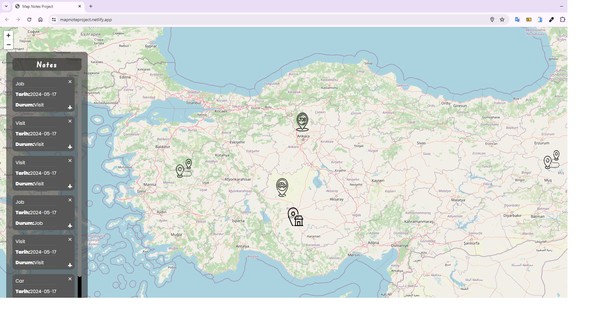

<h1>Map Notes Project</h1>

I developed a travel application using HTML, CSS, and Javascript. An interactive platform where you can take notes on the map: Mark your work, home, travel, and car parking spots and save them with their details! Select the place you want on the map, add dates and details, easily manage your plans, and save your notes.

<h2> The following technologies were used in the frontend development phase of my site: </h2>

- HTML5
- CSS3
- JavaScript

<h2> Visit My Map Notes Project: </h2>

- https://mapnoteproject.netlify.app/

<h4>IMAGE</h4>

